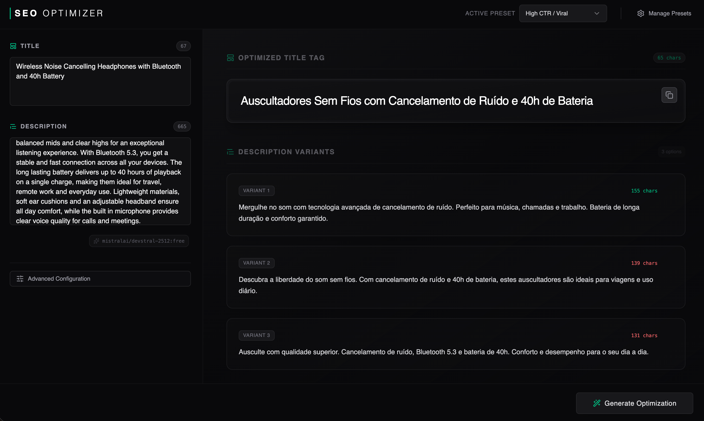

# SEO Optimizer

A modern, AI-powered tool to optimize your page titles and meta descriptions for search engines. Built with React and designed for speed and aesthetics.

 
*(Note: You might want to add a screenshot here)*

## Features

- **AI-Powered Generation**: Uses local Codex by default, or the official OpenAI API when configured.
- **Smart Presets**: Save and manage different prompting strategies (e.g., "Standard SEO", "Click-bait", "E-commerce").
- **Real-time Character Counting**: Visual feedback for character limits (Green for optimal length, Red for invalid).
- **Duplicate Presets**: Easily clone existing presets to create variations.
- **Model Transparency**: Shows which AI model is currently generating your content.

## Tech Stack

- **Frontend**: React, Vite
- **Styling**: Tailwind CSS v4, Lucide React (Icons)
- **AI Integration**: Local Vite/Bun API backed by Codex CLI or the OpenAI SDK
- **State Management**: React `useState` / `useEffect` with local SQLite persistence through the Vite/Bun API
- **Local Data**: Presets and drafts are stored in `database/seo-optimizer.sqlite`

## Getting Started

### Prerequisites

- **Runtime**: Bun (required)
- Bun
- Codex CLI signed in with ChatGPT (`codex login`) for the default local mode
- Optional: an OpenAI Platform API key if you prefer API usage

### Installation

1. Clone the repository:
   ```bash
   git clone https://github.com/xcrap/seooptimizer.git
   cd seooptimizer
   ```

2. Install dependencies:
   ```bash
   bun install
   ```

3. Configure Environment Variables:
   Create a `.env.local` file in the root directory:
   ```env
   APP_URL=http://localhost:5174
   DB_PATH=./database

   SEO_OPTIMIZER_PROVIDER=codex
   SEO_OPTIMIZER_MODEL=gpt-5.4-mini
   SEO_OPTIMIZER_REASONING_EFFORT=medium
   ```

   For the official OpenAI API instead of local Codex:
   ```env
   SEO_OPTIMIZER_PROVIDER=openai
   SEO_OPTIMIZER_MODEL=gpt-5.4-mini
   SEO_OPTIMIZER_REASONING_EFFORT=medium
   OPENAI_API_KEY=your_openai_api_key_here
   ```

4. Run the development server:
   ```bash
   bun run dev
   ```

The app calls `/api/optimize` on the same app server. No provider key is exposed to the browser.

This app uses one server: Vite serves the React app and mounts `/api/*` in the same process. Set `APP_URL` to the URL where the app runs. Locally, include the port in `APP_URL`, for example `http://localhost:5174`; online, use your domain, for example `https://seo.example.com`. `API_PORT` and `API_URL` are not needed for the current single-server setup.

Preset prompts, the selected preset, and title/description drafts are saved under `DB_PATH`, which defaults to `database/` and uses `seo-optimizer.sqlite` inside that directory. The database file and its SQLite sidecar files are git-ignored. On first launch after upgrading from browser storage, the app migrates existing `localStorage` presets/drafts into SQLite and clears the old browser keys after the migration succeeds.

`bun run build` still creates a static frontend in `dist/`, but AI generation and local persistence need the server-side `/api/*` endpoints. For local use, run Vite dev or preview so the bundled local API middleware is available.

## Usage

1. **Enter Content**: Paste your current page title and description (or leave blank).
2. **Select Preset**: Choose a preset strategy from the top bar (or create your own in "Manage Presets").
3. **Generate**: Click "Generate Optimization" to receive AI-suggested variations.
4. **Copy**: Click the copy icon to grab the suggestions.

## License

MIT
